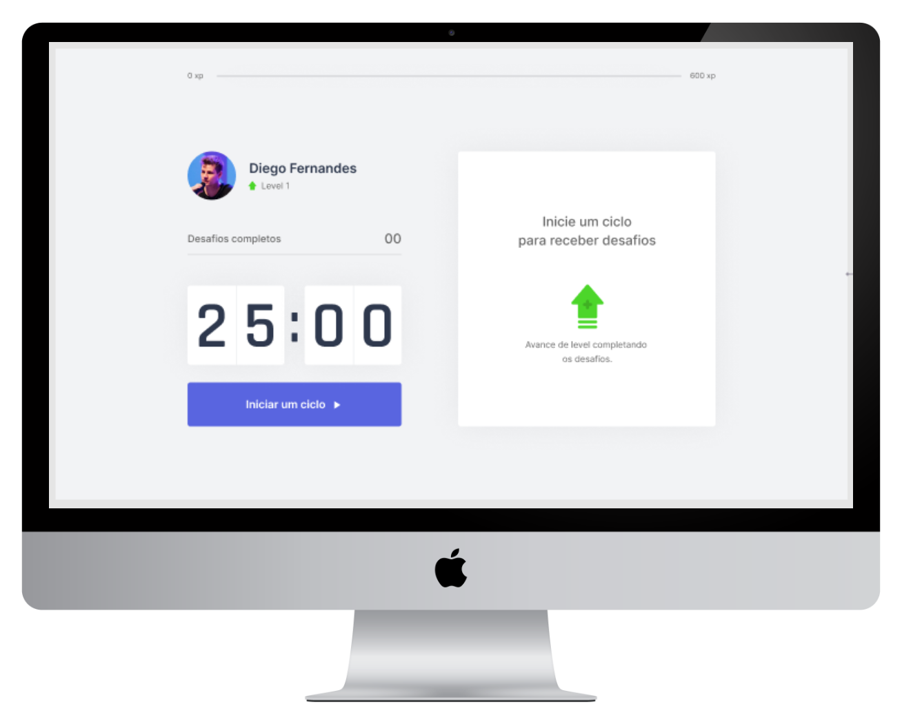

<div align="center">
  
</div>


<h3 align="center">
    Application developed in the fourth edition of Rocketseat Next Level Week 💻🚀
</h3>

<p align="center">
  

  
  
  <a href="https://github.com/kelwys/nlw4-moveit/commits/master">
    
  </a>
    
   
   <a href="https://github.com/kelwys/nlw4-moveit/stargazers">
    
  </a>
</p>

<p align="center">
  <a href="#about-the-project">About The Project</a> •
  <a href="#layout">Layout</a> •
  <a href="#technologies">Technologies</a> • 
  <a href="#contribution">Contribution</a> • 
  <a href="#author">Author</a> • 
  <a href="#license">License</a>
</p>

<h4 align="center">
	🚧  Building 🚀  🚧
</h4>
</br>


<h2 id="about-the-project" > ⏰📈 About The Project </h2>

Track your time and be more productive.

Project developed during **NLW4 - Next Level Week** offered by [Rocketseat](https://blog.rocketseat.com.br/primeira-next-level-week/). NLW is an online experience with lots of practical content, challenges and hacks where the content is available for a week.


---

<h2 id="layout" >🎨  Layout </h2>

The layout of Move.it is available in:

<a href="https://www.figma.com/file/ge20pu3ofMOKoliUyKx1Nl/?viewer=1&node-id=">
  
</a>

<p align="center" style="display: flex; align-items: flex-start; justify-content: center;">
  
</p>

---

## 🚀 Getting Started

First, run the development server:

```bash
npm run dev
# or
yarn dev
```
---


<h2 id="technologies"> 🛠 Technologies </h2>

The following tools were used in the construction of the project:

- **[React](https://reactjs.org)**
- **[Next](https://nextjs.org)**
- **[TypeScript](https://www.typescriptlang.org/)**

---

<h2 id="contribution"> 💪 Contribution </h2>

Contributions are what make the open source community such an amazing place to be learn, inspire, and create. Any contributions you make are **greatly appreciated**.

1. Fork the Project
2. Create your Feature Branch (`git checkout -b feature/AmazingFeature`)
3. Commit your Changes (`git commit -m 'Add some AmazingFeature'`)
4. Push to the Branch (`git push origin feature/AmazingFeature`)
5. Open a Pull Request

---

<h2 id="author"> 💻 Author </h2>

<style>
  img[src$="#avatar"] {
    margin: 0 auto;
    border-radius: 50%;
    width: 100px;
  }
</style>


 <br />
 <sub><b>Kelwy Oliveira</b></sub></a> <a href="https://www.linkedin.com/in/kelwyoliveira/" title="kelwy`s linkedin">🚀</a>
 <br />

[](https://www.linkedin.com/in/kelwyoliveira/) 
[](mailto:kelwyduarte@gmail.com)

---

<h2 id="license"> 📝 License </h2>

This project is under the [MIT](./LICENSE) license.

---
